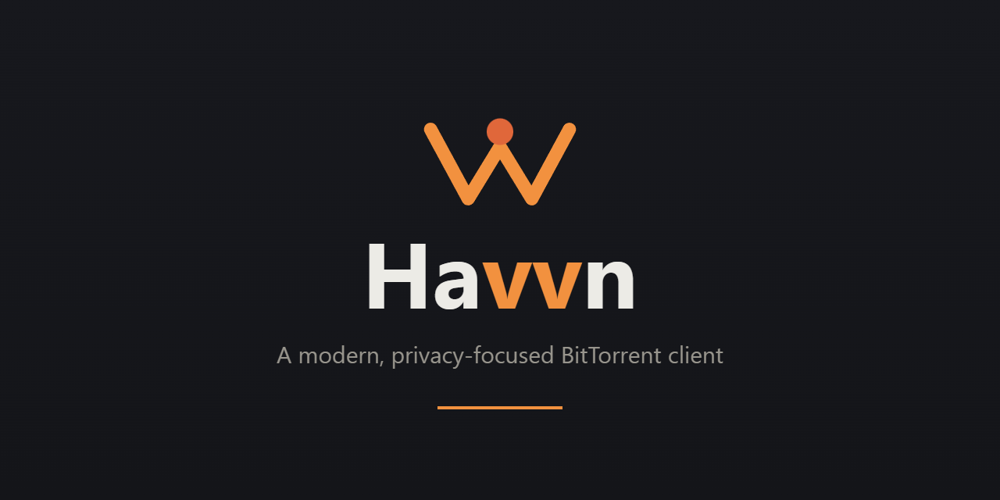

<p align="center">
  
</p>

# Havvn


**A private, serverless P2P hub that happens to speak BitTorrent.**

Havvn (formerly TorrentHunt) is a fully-featured torrent client — but that's the foundation, not the
point. Its real job is the things classic clients *can't* do, all peer-to-peer with
**no servers, no accounts, and nothing in the cloud**:

- 📺 **Watch anywhere.** Stream a torrent *while it's still downloading* to your phone,
  laptop or TV — even formats the browser can't natively play (transcoded on the fly).
- 🔗 **Share without friction.** Send a finished download straight into a friend's
  **browser** over a link — no install, no account on their side.
- 👥 **Private friend rooms.** Spin up an invite-only **room** where everyone's files
  auto-sync into a shared folder and you **chat, end-to-end encrypted and signed**.
  Connections even hop between members, so a room works across home networks **without
  any infrastructure of its own**.
- 🛡️ **See what the swarm sees.** A live privacy dashboard shows your exposed IP, ISP
  and VPN status, with IP-leak detection and a kill-switch.

You bring your own indexers and feeds — Havvn bundles none. Everything runs on
your machine and directly between you and your peers: **the developer runs no servers,
and the app costs nothing to operate.** Built with Electron, React and WebTorrent.

> **Legal use only.** Havvn does not bundle indexers for copyrighted material.
> The only pre-seeded source is a Creative Commons / open-source RSS feed (FOSS Torrents),
> shipped **disabled**. Any search providers or additional RSS feeds are added by you, and
> you are responsible for what you download and share.

---

## Download

Grab the latest Windows installer from the
**[Releases page](https://github.com/NIHILcoder/Havvn/releases/latest)**.

### Verify your download

Every release is scanned with [VirusTotal](https://www.virustotal.com/) and ships with
a SHA-256 checksum — both are listed in that release's notes. As an open-source desktop
app, the installer may trigger a SmartScreen "unknown publisher" prompt; verifying the
checksum confirms the file is genuine.

```powershell
Get-FileHash .\Havvn-Setup-<version>.exe -Algorithm SHA256
```

Compare the output against the SHA-256 published in the matching GitHub release.

---

## Features

### Downloads
- Add torrents via **.torrent file, magnet link, or drag & drop** — local files *and*
  remote `.torrent` URLs are supported
- Pause / resume / remove (with optional file deletion), retry failed downloads
- **Per-file selection & priority**, sequential download, global speed limit
- **Seed ratio / seed time limits**, tracker add/remove per torrent
- Categories, search/filter/sort, list & detailed views
- Open the OS "open with" dialog when you double-click a `.torrent` — no silent adds

### Discover content
- **Pluggable search providers** — bring your own **Jackett**, **Prowlarr (Torznab)**, or
  a custom JSON API; test connectivity from the UI. No indexers are bundled
- **RSS feeds** with auto-download, regex title filters and per-feed intervals; only new
  items (after you subscribe) are grabbed, never the whole back-catalogue. One legal FOSS
  feed is pre-seeded **disabled** (opt-in, no background traffic until you enable it) —
  plus one-click list cleanup

### Stream & watch
- **Built-in player** — watch/listen to a file *while it's still downloading*; playback
  starts before the download finishes
- **Subtitles** — embedded text tracks (mkv, etc.) and sidecar `.srt` / `.ass` / `.vtt`
  files are converted to WebVTT on the fly and overlaid on playback
- **On-the-fly transcoding** — formats the browser can't decode (mkv, HEVC, AVI…) are
  converted live via the bundled ffmpeg, no external player needed
- **Watch on another device (LAN)** — one click shows a QR code + link; open it on a phone,
  tablet or laptop on the **same Wi-Fi** and stream the torrent with **seeking**, even for
  exotic codecs (served as adaptive HLS straight from your PC — no cloud, no app on the
  other device)
- **Cast to TV** — find Chromecast / Android TV / Google TV devices on your network and
  play a torrent on the big screen with pause / resume / stop controls
- **Watch anywhere (experimental)** — stream a torrent to a device *outside* your network
  over WebRTC, transcoded on the fly

### Create & share
- Create torrents from files or folders (single or batch), custom trackers, private flag,
  start-seeding-immediately
- **Instant Share Links** — send a completed download to anyone via a browser link
  (peer-to-peer over WebRTC, no install on their side); short links + QR
- **Rooms (friend swarms)** — create a private group, share a speakable invite code, and
  everyone's files auto-distribute peer-to-peer into a shared folder. No cloud: members
  find each other over WebRTC and converge a file manifest, live presence, and
  **end-to-end encrypted chat** over **AES-256-GCM** channels keyed from the code
- **End-to-end encrypted rooms** — opt in at creation and the swarm carries **ciphertext
  only**: files are encrypted on your disk before seeding and decrypted after download,
  never plaintext on the wire. The room's content key is **distributed in an
  owner-signed config (Ed25519)** so a member who merely holds the invite code can't
  plant or forge one, and the invite code itself marks the room encrypted so a joiner
  never seeds plaintext by mistake
- **Watch & listen together** — open a shared file in the in-app theater and flip on
  **"together"**: playback stays in sync across the room (play/pause/seek follow, and
  late joiners catch up to the current position). Music files get a dedicated mode — an
  album-art disc from the track's **ID3 tags**, a live **WebAudio spectrum**, a shared
  queue that auto-advances, and floating emoji reactions
- **Per-room controls** — auto-download every shared file or pull them **manually** per
  file, and set per-room **upload / download speed limits**
- **Tamper-proof chat** — every message is **signed (Ed25519)** and bound to a member
  identity, so even someone who has the invite code can't post under another member's
  name; the local chat history is **encrypted at rest**
- **Pick your avatar** — choose from several deterministic avatar styles for your room
  profile, generated on your device and never uploaded
- **Connects across networks, zero infrastructure** — direct/IPv6/STUN cover the common
  cases, and members who still can't reach each other are relayed **through another
  member** automatically (relayed traffic stays end-to-end encrypted). For the rare
  strict-NAT pair you can add **your own TURN relay** in settings — one side is enough.
  Each member shows whether they're connected **directly or via a relay**

### Automation & networking
- **Scheduler** for time-based bandwidth rules (supports windows that cross midnight)
- **Watch folder** — auto-add `.torrent` files dropped into a directory
- **IP blocklist** support (load lists by URL, applied to the engine)
- **Advanced engine controls** — DHT toggle, max connections, listening port
- **Pause All / Resume All** from the toolbar or the system-tray menu

### Desktop experience
- **Background mode** — closing the window minimizes to the **system tray** so torrents
  keep running; uses your `icon.ico`
- Run at login, close/minimize-to-tray, native completion notifications
- **Two-pillar layout** — a **Transfers | Rooms** switch keeps downloading and
  shared-listening as distinct spaces, bridged by a persistent status strip that surfaces
  live speed/peers and who's listening right now
- **Themes** (dark / light / system) with a clean **Ember** design (warm accents on a
  graphite ground) and a Double-V logomark
- **Customizable hotkeys**
- **Localization** — English & Russian
- Settings export / import

### Privacy & anonymity
- **Live exposure dashboard** — see your public IP (the one peers connect to), ISP,
  location and VPN status at a glance, with a colour-coded posture banner
- **IP-leak detection** — warns when your torrent-facing IP looks like a consumer ISP
  rather than a VPN, so you catch a leak before downloading (lookups run only on open /
  refresh, no background traffic)
- **VPN kill-switch** — auto-pauses all torrents if your VPN drops, plus a startup check
- **One-click recommended privacy preset**, ephemeral peer ID, log sanitization, clear
  data on exit, and open/clear-logs controls
- **Secrets encrypted at rest** via OS-level encryption (DPAPI / Keychain / libsecret)

### Application security
- Context isolation, sandboxed renderer, Node integration disabled, type-safe IPC bridge
- Content-Security-Policy and navigation guards in production builds
- The local streaming server refuses cross-origin and DNS-rebinding requests, so a web
  page open in your browser can't read what you're streaming

---

## Tech Stack

| Layer        | Technology                                   |
|--------------|----------------------------------------------|
| UI           | React 18, TypeScript, Framer Motion, Recharts |
| State        | Zustand                                      |
| Desktop      | Electron 42, Node.js                          |
| Torrents     | Transmission (bundled native engine) with a WebTorrent fallback; WebTorrent + WebRTC for rooms & share links |
| Persistence  | electron-store (local JSON)                   |
| Build        | webpack (renderer), tsc (main), electron-builder |

---

## Getting Started

### Prerequisites
- **Node.js 18+** and npm
- Windows 10+, macOS 10.14+, or a modern Linux distribution

### Install
```bash
npm install
```

### Run in development
Starts the webpack dev server and Electron with hot reload:
```bash
npm run dev
```

### Build
```bash
npm run build        # compile main + renderer
npm run typecheck    # type-check both projects
npm run lint         # lint
```

### Package a desktop installer
```bash
npm run dist         # builds and packages (Windows NSIS by default)
```
Packaged output is written to `release/`.

---

## Project Structure

```
electron/            Main process (TypeScript)
  torrent/           WebTorrent manager, creator, watch folder, LAN cast/HLS server
  services/          RSS, search, IP blocklist
  sharing/           Share Links + Rooms (WebRTC seeder/engine in a hidden window)
  scheduler/         Time-based scheduler engine
  db/                electron-store wrapper
  ipc/               Typed IPC handlers
  utils/             Logger, VPN detection, secure store, helpers
  main.ts            App lifecycle, tray, window, security
  preload.ts         contextBridge IPC API
renderer/            React UI (pages, components, stores, i18n)
shared/              Types and the download state machine
build/               App icons & installer resources
```

---

## Architecture

### Download state machine
Downloads follow a validated lifecycle (`shared/state-machine.ts`):

```
QUEUED → DOWNLOADING → COMPLETED → SEEDING
   ↓         ↓            ↓           ↓
   └──────→ PAUSED ←──────┴───────────┘
             ↓
          ERROR → REMOVED
```
Invalid transitions are rejected to keep state consistent.

### Persistence
Downloads, settings, feeds and providers are stored locally via
**electron-store** (JSON). Progress is written on a debounced interval (batched into a
single write) to keep disk I/O low while torrents are active, so downloads resume after a
restart.

### Process & security model
- Renderer runs context-isolated and sandboxed; Node integration is disabled
- A minimal, type-safe preload bridge exposes only the IPC surface the UI needs
- Production builds apply a Content-Security-Policy and block in-app navigation to
  external origins (external links open in the default browser)

### Logging
Structured logs are written to the app's `logs/` directory with daily rotation,
multiple severity levels, and automatic cleanup of old files.

---

## Known Limitations

- **Speed limits** are applied best-effort via WebTorrent's throttling API and may vary by
  version. For strict control, use OS-level network management.
- **Peer statistics**: WebTorrent reports aggregate peers and does not cleanly separate
  seeds from leechers, so those numbers are approximate.
- **VPN / IP-leak detection** is heuristic (network interfaces, IP/ISP lookup) — it's a
  strong safety net, not a guarantee. A VPN with its own kill-switch remains the real
  protection.
- **Proxy**: there is no SOCKS/HTTP proxy option — WebTorrent can't route peer traffic
  through one, so use a VPN for network privacy.
- **Watch anywhere (remote WebRTC streaming)** is experimental and depends on NAT
  traversal; it may not connect on every network.
- **Room connectivity across strict NAT**: rooms connect for the large majority of
  networks via direct/IPv6/STUN and **peer-relay through another member**. The one case
  that can't connect with zero infrastructure is a room where *every* member is behind a
  strict (symmetric) NAT and none is reachable — add **your own TURN relay** in settings
  (one member is enough) for that.

---

## Contributing

CI runs on every push / PR (`.github/workflows/ci.yml`): type-check and build are required
gates; lint runs as advisory. Please run `npm run typecheck` and `npm run build` before
opening a PR.

---

## License

MIT License — see the `LICENSE` file.

Copyright © 2026 Havvn. Free to use, modify and distribute under the terms of the
MIT License.
