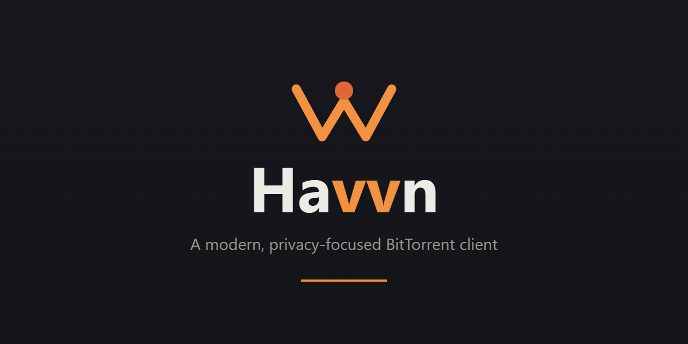

<p align="center">
  
</p>

# Havvn

[](https://github.com/NIHILcoder/Havvn/releases/latest)
[](https://github.com/NIHILcoder/Havvn/releases)


**A private, serverless P2P hub that happens to speak BitTorrent.**

Havvn (formerly TorrentHunt) is a fully-featured torrent client — but that's the foundation, not the
point. Its real job is the things classic clients *can't* do, all peer-to-peer with
**no servers, no accounts, and nothing in the cloud**:

- 📺 **Watch anywhere.** Stream a torrent *while it's still downloading* to your phone,
  laptop or TV — even formats the browser can't natively play (transcoded on the fly).
- 🔗 **Share without friction.** Send a finished download straight into a friend's
  **browser** over a link — no install, no account on their side.
- 👥 **Private friend rooms.** Spin up an invite-only **room** where everyone's files
  auto-sync into a shared folder and you **chat, end-to-end encrypted and signed**.
  Connections even hop between members, so a room works across home networks **without
  any infrastructure of its own**.
- 🎮 **Play together.** A room can become a **private LAN** so games that only speak
  local network work over the internet, and you can run a **dedicated server** inside
  the room — no accounts, no hosted game service.
- 🎙️ **Hang out in voice.** Serverless room voice chat with **neural noise suppression**,
  **screen sharing** (system audio included, echo-cancelled) and a **global push-to-talk**.
- 🛡️ **See what the swarm sees.** A live privacy dashboard shows your exposed IP, ISP
  and VPN status, with IP-leak detection and a kill-switch.

You bring your own indexers and feeds — Havvn bundles none. Everything runs on
your machine and directly between you and your peers: **the developer runs no servers,
and the app costs nothing to operate.** The one external dependency is a set of public
WebRTC **rendezvous trackers** that broker the initial handshake — they never carry file
bytes or plaintext, three independent operators are used so none is load-bearing, and
you can point Havvn at **your own trackers** in Settings → Sharing. Built with Electron,
React, a bundled native Transmission engine and WebTorrent.

> **Legal use only.** Havvn does not bundle indexers for copyrighted material.
> The only pre-seeded source is a Creative Commons / open-source RSS feed (FOSS Torrents),
> shipped **disabled**. Any search providers or additional RSS feeds are added by you, and
> you are responsible for what you download and share.

---

## Download

Grab the latest Windows installer from the
**[Releases page](https://github.com/NIHILcoder/Havvn/releases/latest)**.

### Verify your download

Every release is scanned with [VirusTotal](https://www.virustotal.com/) and ships with
a SHA-256 checksum — both are listed in that release's notes. As an open-source desktop
app, the installer may trigger a SmartScreen "unknown publisher" prompt; verifying the
checksum confirms the file is genuine.

```powershell
Get-FileHash .\Havvn-Setup-<version>.exe -Algorithm SHA256
```

Compare the output against the SHA-256 published in the matching GitHub release.

---

## Features

### Downloads
- **Bundled native Transmission engine** for fast, battle-tested transfers, with a
  WebTorrent fallback (WebTorrent also powers rooms and share links)
- Add torrents via **.torrent file, magnet link, or drag & drop** — local files *and*
  remote `.torrent` URLs are supported — or **search from Downloads** without leaving
  the add flow
- Pause / resume / remove (with optional file deletion), retry failed downloads
- **Per-file selection & priority**, sequential download, global speed limit
- **Seed ratio / seed time limits**, tracker add/remove per torrent
- **Category and paused** on add — from the dialog, from search, and from RSS — so a
  week of grabs does not land in one pile already transferring
- Categories, search/filter/sort, list & detailed views
- Open the OS "open with" dialog when you double-click a `.torrent` — no silent adds

### Discover content
- **Pluggable search** — bring your own **Jackett**, **Prowlarr (Torznab)**, a custom
  JSON API, or a **local Python script**. No indexers are bundled. Results arrive as
  each provider answers (and can be cancelled), collapse into **one row per torrent**,
  and carry the actions that matter: pick files, copy the magnet, open the release
  page, add paused into a category. Categories come from the indexer (`t=caps`). A
  script can describe itself in a `th-plugin` comment so you see its name and required
  credentials before a search fails — see [search plugins](docs/search-plugins/)
- **RSS as a rule engine** — a rule watches any set of feeds (or all of them), matches
  on words or a regex with include and exclude, bounds size, seeds and age, and files
  what it grabs with its own path, category and paused choice. Smart episode matching
  keeps **one copy per episode** when several groups post the same one. Feeds import
  and export as **OPML**. New items raise a notification if you asked to be told;
  rows you dismiss leave the list but stay remembered so a rule cannot grab them
  again. Only items that appear after you subscribe are grabbed, never the
  back-catalogue. One legal FOSS feed is pre-seeded **disabled** (opt-in, no
  background traffic until you enable it)

### Stream & watch
- **Built-in player** — watch/listen to a file *while it's still downloading*; playback
  starts before the download finishes. Music and video **open in their own window**
  (the app's chrome, not an OS caption) and come home on demand; position, pause and
  volume survive the trip
- **A mixing desk for music** — five-band equaliser with presets, loudness levelling,
  repeat/shuffle and an output device, remembered across tracks, windows and sessions
- **Subtitles** — embedded text tracks (mkv, etc.) and sidecar `.srt` / `.ass` / `.vtt`
  files are converted to WebVTT on the fly and overlaid on playback
- **On-the-fly transcoding** — formats the browser can't decode (mkv, HEVC, AVI…) are
  converted live via the bundled ffmpeg, no external player needed
- **Watch on another device (LAN)** — one click shows a QR code + link; open it on a phone,
  tablet or laptop on the **same Wi-Fi** and stream the torrent with **seeking**, even for
  exotic codecs (served as adaptive HLS straight from your PC — no cloud, no app on the
  other device)
- **Cast to TV** — find Chromecast / Android TV / Google TV devices on your network and
  play a torrent on the big screen with pause / resume / stop controls
- **Watch anywhere (experimental)** — stream a torrent to a device *outside* your network
  over WebRTC, transcoded on the fly

### Create & share
- Create torrents from files or folders (single or batch), custom trackers, private flag,
  start-seeding-immediately
- **Instant Share Links** — send a completed download to anyone via a browser link
  (peer-to-peer over WebRTC, no install on their side); short links + QR
- **Rooms (friend swarms)** — create a private group, share a speakable invite code, and
  everyone's files auto-distribute peer-to-peer into a shared folder. No cloud: members
  find each other over WebRTC and converge a file manifest, live presence, and
  **end-to-end encrypted chat** over **AES-256-GCM** channels keyed from the code
- **A real app-grade room layout** — three regions (People + Voice | Stage | Chat) with
  draggable splitters that remember their widths; **tear any panel out** (chat, voice,
  files, LAN, server) into its own window and drag it to a second monitor — a call
  stays connected and a download keeps going
- **End-to-end encrypted rooms** — opt in at creation and the swarm carries **ciphertext
  only**: files are encrypted on your disk before seeding and decrypted after download,
  never plaintext on the wire. The room's content key is **distributed in an
  owner-signed config (Ed25519)** so a member who merely holds the invite code can't
  plant or forge one, and the invite code itself marks the room encrypted so a joiner
  never seeds plaintext by mistake
- **Organize the shared folder** — top-level **sections** with folders inside, drag & drop
  onto either level, and **per-folder auto-download** that inherits section → room
  settings (or pull files manually, per file)
- **A files zone that works like a file manager** — context menus, hover actions, filter
  chips, view options, per-room sort & collapse memory, search highlighting,
  **image thumbnails with a lightbox**, Show-in-folder, and a total-size readout — and
  huge rooms stay smooth thanks to **virtualized lists**
- **Watch & listen together** — open a shared file in the in-app theater and flip on
  **"together"**: playback stays in sync across the room (play/pause/seek follow, and
  late joiners catch up to the current position). Music files get a dedicated mode — an
  album-art disc from the track's **ID3 tags**, a live **WebAudio spectrum**, a shared
  queue that auto-advances, and floating emoji reactions
- **Watch while it downloads** — start a shared video in the room theater *before* the
  download finishes (non-E2E rooms, browser-native formats)
- **Member profiles** — signed profiles with name colors, status lines and a pick of
  deterministic avatar styles, generated on your device and never uploaded; open a
  **profile card** from any member or message
- **Invite previews** — the invite dialog shows who's inside, file count and total size,
  and whether voice is live, with a prominent copy button
- **Ownership transfer** — hand a room to another member with a **signed transfer chain**,
  so clients can verify the new owner instead of trusting a claim
- **Per-room controls** — auto-download every shared file or pull them **manually** per
  file, and set per-room **upload / download speed limits**
- **Signed chat** — every message is **signed (Ed25519)** and bound to a member
  identity, so even someone who has the invite code can't post under another member's
  name; the local chat history is **encrypted at rest**. The composer is built for
  sharing scripts: multiline input, Tab indents, and triple-backtick **code blocks**
  with copy
- **Connects across networks, zero infrastructure** — direct/IPv6/STUN cover the common
  cases, and members who still can't reach each other are relayed **through another
  member** automatically (relayed traffic stays end-to-end encrypted). For the rare
  strict-NAT pair you can add **your own TURN relay** in settings — one side is enough.
  Each member shows whether they're connected **directly or via a relay**
- **Bring your own rendezvous trackers** — rooms, share links and remote cast announce to
  public WebRTC trackers to broker the first handshake (no file bytes, no plaintext). Point
  Havvn at your own instead in Settings → Sharing; an unusable entry falls back to the
  public set rather than leaving a room with nowhere to announce

### Play together
- **Virtual LAN** — the host starts a session, admitted members get a virtual address
  and a direct encrypted link. Broadcast and multicast are replicated so LAN games
  find each other without anyone typing an address; a server hosted in the room is
  announced the same way. Relayed paths are opt-in and never drawn as a healthy
  direct link. **Windows only**, for now — other members still share files, chat and
  voice
- **A dedicated server in the room** — install, start, stop and a live console from
  the room itself; mods shared in the room can be mirrored in with consent. Minecraft
  is the module that exists today; others are named as coming

### Voice & screen share
- **Room voice chat with zero infrastructure** — a serverless WebRTC mesh between
  members, end-to-end like everything else in a room
- **Neural noise suppression** — RNNoise (Off / Standard / Enhanced) running in a
  WASM AudioWorklet, so keyboards and fans don't make the trip
- **Screen sharing, watched on demand** — share a screen or window into the room;
  optionally capture **system audio**, echo-cancelled so your speakers don't loop back
- **Global push-to-talk** — a system-wide hotkey that works while the app is in the
  background
- **Real device controls** — mic & output pickers, input gain, output volume,
  voice-activity sensitivity, and a **live mic test you can actually hear** through your
  chosen output device
- **Connection quality at a glance** — each tile shows good / fair / poor and
  reconnecting states

### Automation & networking
- **Scheduler** for time-based bandwidth rules (supports windows that cross midnight)
- **Watch folder** — auto-add `.torrent` files dropped into a directory
- **IP blocklist** support (load lists by URL, applied to the engine)
- **Advanced engine controls** — DHT toggle, max connections, listening port
- **Pause All / Resume All** from the toolbar or the system-tray menu

### Desktop experience
- **Background mode** — closing the window minimizes to the **system tray** so torrents
  keep running; uses your `icon.ico`
- Run at login, close/minimize-to-tray, native completion notifications
- **Two-pillar layout** — a **Transfers | Rooms** switch keeps downloading and
  shared-listening as distinct spaces, bridged by a persistent status strip that surfaces
  live speed/peers and who's listening right now
- **Custom themes** — dark / light / system on the warm **Ember** palette (and the
  W-wings logomark), plus a **live theme editor**: two-mode token editing, JSON
  import/export, and a sanitizer so a shared theme can't break the app
- **Customizable hotkeys**
- **Localization** — English & Russian
- Settings export / import

### Privacy & anonymity
- **Live exposure dashboard** — see your public IP (the one peers connect to), ISP,
  location and VPN status at a glance, with a colour-coded posture banner
- **IP-leak detection** — warns when your torrent-facing IP looks like a consumer ISP
  rather than a VPN, so you catch a leak before downloading (lookups run only on open /
  refresh, no background traffic)
- **VPN kill-switch** — auto-pauses all torrents if your VPN drops, plus a startup check
  (and it covers rooms, too)
- **One-click recommended privacy preset**, ephemeral peer ID, log sanitization, clear
  data on exit, and open/clear-logs controls
- **Secrets encrypted at rest** via OS-level encryption (DPAPI / Keychain / libsecret)

### Application security
- Context isolation, sandboxed renderer, Node integration disabled, type-safe IPC bridge
- Content-Security-Policy and navigation guards in production builds
- The local streaming server refuses cross-origin and DNS-rebinding requests, so a web
  page open in your browser can't read what you're streaming

### Security status

Havvn's room protocol is built on standard primitives — **AES-256-GCM** for content and
chat, **Ed25519** signatures for member identity, config authorship and ownership
transfer — but the protocol composing them is **my own design and has not had an
independent security review or audit**. It is written to resist a specific, concrete
threat: someone who holds a room's invite code but was never granted membership should
not be able to forge a config, impersonate a member, or plant a content key.

It is *not* built to withstand a well-resourced attacker, and it has not been tested
against one. Treat the encryption as meaningful protection from casual interception and
from other peers in the swarm — not as a guarantee for a threat model where being wrong
carries real consequences. If you find a flaw, please open an issue; I would rather hear
it than not.

---

## Tech Stack

| Layer        | Technology                                   |
|--------------|----------------------------------------------|
| UI           | React 18, TypeScript, d3-geo (swarm map)      |
| State        | Zustand                                      |
| Desktop      | Electron 42, Node.js                          |
| Torrents     | Transmission (bundled native engine) with a WebTorrent fallback; WebTorrent + WebRTC for rooms & share links |
| Voice        | WebRTC mesh, RNNoise noise suppression (WASM AudioWorklet), global hotkeys via uiohook |
| Persistence  | electron-store (local JSON)                   |
| Tests        | Vitest                                        |
| Build        | webpack (renderer), tsc (main), electron-builder |

---

## Getting Started

### Prerequisites
- **Node.js 18+** and npm
- Windows 10+, macOS 10.14+, or a modern Linux distribution

### Install
```bash
npm install
```

### Run in development
Starts the webpack dev server and Electron with hot reload:
```bash
npm run dev
```

### Build
```bash
npm run build        # compile main + renderer
npm run typecheck    # type-check both projects
npm test             # unit tests (vitest)
npm run lint         # lint
```

### Package a desktop installer
```bash
npm run dist         # builds and packages (Windows NSIS by default)
```
Packaged output is written to `release/`.

---

## Project Structure

```
electron/            Main process (TypeScript)
  torrent/           Torrent engines, creator, watch folder, LAN cast/HLS server
  services/          RSS, search, IP blocklist
  sharing/           Share Links + Rooms (WebRTC seeder/engine in a hidden window)
  lan/               Virtual LAN (Windows)
  gameserver/        In-room dedicated servers
  scheduler/         Time-based scheduler engine
  db/                electron-store wrapper
  ipc/               Typed IPC handlers
  utils/             Logger, VPN detection, secure store, helpers
  main.ts            App lifecycle, tray, window, security
  preload.ts         contextBridge IPC API
renderer/            React UI (pages, components, stores, i18n)
shared/              Types, parsers, rule matching, the download state machine
vendor/              Bundled native engine (Transmission)
build/               App icons & installer resources
```

---

## Architecture

### Download state machine
Downloads follow a validated lifecycle (`shared/state-machine.ts`):

```
QUEUED → DOWNLOADING → COMPLETED → SEEDING
   ↓         ↓            ↓           ↓
   └──────→ PAUSED ←──────┴───────────┘
             ↓
          ERROR → REMOVED
```
Invalid transitions are rejected to keep state consistent.

### Persistence
Downloads, settings, feeds, rules and providers are stored locally via
**electron-store** (JSON). Progress is written on a debounced interval (batched into a
single write) to keep disk I/O low while torrents are active, so downloads resume after a
restart.

### Process & security model
- Renderer runs context-isolated and sandboxed; Node integration is disabled
- A minimal, type-safe preload bridge exposes only the IPC surface the UI needs
- Production builds apply a Content-Security-Policy and block in-app navigation to
  external origins (external links open in the default browser)

### Logging
Structured logs are written to the app's `logs/` directory with daily rotation,
multiple severity levels, and automatic cleanup of old files.

---

## Known Limitations

- **Speed limits** are enforced by the native engine for regular torrents; for rooms and
  share links (WebTorrent) they're applied best-effort via throttling. For strict
  control, use OS-level network management.
- **Peer statistics** for rooms and share links are approximate — WebTorrent reports
  aggregate peers and does not cleanly separate seeds from leechers.
- **VPN / IP-leak detection** is heuristic (network interfaces, IP/ISP lookup) — it's a
  strong safety net, not a guarantee. A VPN with its own kill-switch remains the real
  protection.
- **Proxy**: there is no SOCKS/HTTP proxy option for peer traffic — use a VPN for
  network privacy.
- **Watch anywhere (remote WebRTC streaming)** is experimental and depends on NAT
  traversal; it may not connect on every network.
- **Room connectivity across strict NAT**: rooms connect for the large majority of
  networks via direct/IPv6/STUN and **peer-relay through another member**. The one case
  that can't connect with zero infrastructure is a room where *every* member is behind a
  strict (symmetric) NAT and none is reachable — add **your own TURN relay** in settings
  (one member is enough) for that.
- **Watch-while-downloading in rooms** covers non-E2E rooms and browser-native formats;
  everything else plays the moment the download completes.
- **Virtual LAN is Windows only** — members on macOS or Linux can still share files,
  chat and voice; they cannot join the tunnel.
- **Game servers** — Minecraft is the only module so far, and a server lives on its
  host's machine.

---

## Contributing

CI runs on every push / PR (`.github/workflows/ci.yml`): type-check and build are required
gates; lint runs as advisory. Please run `npm run typecheck`, `npm test` and `npm run build`
before opening a PR.

---

## License

MIT License — see the `LICENSE` file.

Copyright © 2026 Havvn. Free to use, modify and distribute under the terms of the
MIT License.
