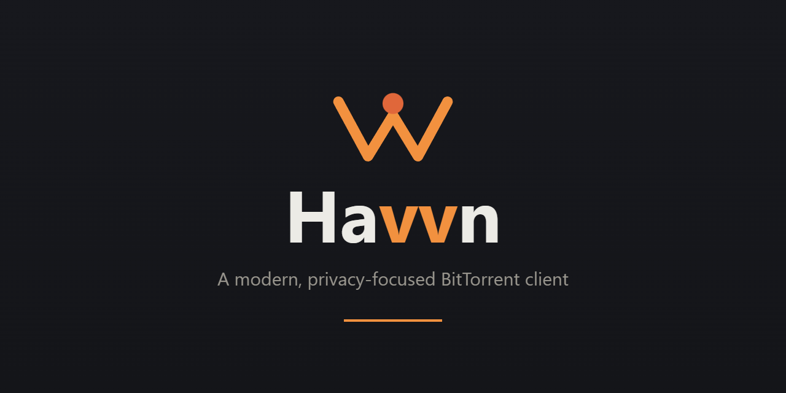

<p align="center">
  <a href="README.md"></a>
  <a href="README.ru.md"></a>
  <a href="README.zh-CN.md"></a>
</p>

<p align="center">
  
</p>

# Havvn

[更新日志 — 3.1.0](CHANGELOG.md#310---2026-10-05)

[](https://github.com/NIHILcoder/Havvn/releases/latest)
[](https://github.com/NIHILcoder/Havvn/releases)


**一个支持 BitTorrent、无需自建服务器的私密 P2P 中心。**

Havvn（原名 TorrentHunt）是一款功能完整的种子客户端，但下载只是它的基础。
它还提供传统客户端通常不具备的功能，全部通过点对点连接实现：
**无需应用服务器、无需 Havvn 账户、不在云端存储数据**。

- 📺 **随处观看。** 在种子*尚未下载完成时*，将视频传到手机、笔记本或电视。
  浏览器无法直接播放的格式会实时转码。
- 🔗 **通过链接分享。** 将已完成的下载直接发送到朋友的**浏览器**，
  对方无需安装应用或注册账户。
- 👥 **好友私密房间。** 创建仅限邀请加入的**房间**，成员的文件自动同步到共享文件夹，
  **聊天采用端到端加密和数字签名**。连接也可以通过其他成员转发，
  无需房间自建服务器即可跨家庭网络使用。
- 🎮 **一起游戏。** 将房间变成**私有局域网**，通过互联网玩仅支持局域网的游戏，
  也可在房间内运行**专用游戏服务器**，无需账户或托管游戏服务。
- 🎙️ **语音交流。** 无应用服务器的房间语音聊天，支持**神经网络降噪**、
  **屏幕共享**（含系统声音和回声消除）以及**全局按键说话**。
- 🛡️ **检查网络出口。** 隐私面板分别显示直接请求的 IP、系统网页代理和本地隧道路由，
  支持 VPN 断网保护（kill-switch）。

搜索源和订阅源由你自行添加。功能运行在你的设备上，数据直接在成员之间传输：
**开发者不运营服务器，应用也没有服务器运维费用**。
公共 WebRTC **会合 tracker** 用于建立初始连接，不传输文件数据或明文内容。
你可以在“设置 → 共享”中指定**自己的 tracker**。网络发现也使用 STUN；
搜索会访问你配置的服务，IP/运营商查询等可选功能会访问各自的外部服务。
应用基于 Electron、React、内置原生 Transmission 引擎和 WebTorrent。

> **仅供合法使用。** Havvn 不附带用于搜索受版权保护内容的索引器。
> 唯一预置的源是提供 Creative Commons / 开源内容的 FOSS Torrents RSS 订阅源，
> 且**默认禁用**。其他搜索源和 RSS 订阅源由用户自行添加，
> 用户须对下载和分享的内容负责。

---

## 下载

最新 Windows 安装程序可在
**[发行页面](https://github.com/NIHILcoder/Havvn/releases/latest)**下载。

本 README 描述当前 `main` 分支。最新安装包可能尚未包含所有功能，
请查看对应版本的发行说明。

### 验证下载文件

每个发行版本均通过 [VirusTotal](https://www.virustotal.com/) 扫描，并提供 SHA-256 校验值；
两者均列在发行说明中。安装程序可能触发 SmartScreen 的“未知发布者”提示。
核对校验值可确认下载的文件与发布的文件一致。

```powershell
Get-FileHash .\Havvn-Setup-<version>.exe -Algorithm SHA256
```

将输出与对应 GitHub 版本发布的 SHA-256 校验值进行比较。

---

## 功能

### 下载管理

- **内置原生 Transmission 引擎**，提供成熟的高速传输，并以 WebTorrent 作为备用引擎。
  WebTorrent 也用于房间和分享链接。
- 通过 **.torrent 文件、磁力链接或拖放**添加任务，支持本地文件及远程 `.torrent` URL。
  也可**从下载页面直接搜索**，无需退出添加流程。
- 暂停、继续、删除（可同时删除文件），以及重试失败的下载。
- **逐文件选择与优先级**、顺序下载和全局速度限制。
- **默认限制上传速度**：新配置中，普通种子共享 **1024 KB/s（1 MiB/s）**的上传额度。
  可在“设置 → 连接”中修改，已有配置保留原先的限制。
  可选的自适应上传功能会在网络延迟升高时降低上传速度。
- **分享率和做种时间限制**，为单个种子添加或移除 tracker。
- **停止或恢复做种**，与暂停未完成下载分别处理。
  已完成文件仍保留在列表中，可再次开始做种。
- **Tracker 警告与传输错误分开显示**：某个 tracker 拒绝连接，不会将仍在正常传输的任务标为失败。
- 在添加对话框、搜索或 RSS 中选择**下载分类及暂停添加**。
  分类用于组织自己的下载任务，不是源网站的内容搜索过滤器。
- 分类、搜索、筛选、排序，以及列表和详细视图。
- 双击 `.torrent` 时打开系统“打开方式”对话框，不会静默添加任务。

### 内容搜索

- **可扩展搜索源**：自行配置 **Jackett**、**Prowlarr（Torznab）**、自定义 JSON API
  或**本地 Python 脚本**，不附带预配置索引器。各源返回结果后即显示，可取消搜索，
  重复种子会被合并。可选择文件、复制磁力链接、打开发布页面，或以暂停状态添加到下载分类。
  单独重试失败的源时保留其他结果。脚本可通过 `th-plugin` 注释声明名称和所需凭据，
  避免搜索失败后才发现配置缺失，详见[搜索插件说明](docs/search-plugins/)。
- **比较发布版本**：将同一电影或剧集的不同版本分组展开，按发布信息细化结果，
  并标记已添加或已完成的种子。保存分辨率、音轨语言、配音类型、最大大小和最少做种者数偏好，
  将匹配版本优先排序。媒体标签从发布名称中推断，未知信息不会被当作已确认信息。
  点击发布组的**比较**按钮，查看对齐的质量、大小、音轨语言、字幕，以及每个源的
  做种者数和响应时间。名称提示与 Custom JSON/插件的可选报告分别标注；缺少标签
  代表未知。缓存保留原始时间，可以直接下载选定版本。
- **搜索中的下载历史**：已移除种子的标记在重启后仍然保留。
  对于没有哈希值的结果，显示可能匹配的提示，但不阻止再次下载。
  最多保存 1000 条本地记录；清空历史不会删除下载任务或文件。
- **按源设置连接**：系统连接（系统代理/VPN）、直连、可复用的 HTTP/SOCKS5 代理配置及可信镜像。
  兼容的 Python 插件使用 Havvn Network SDK。
  **“登录网站”**会打开独立的源浏览器窗口；登录并完成网站检查后关闭窗口，
  搜索和 `.torrent` 获取将复用该会话。Chrome/Edge 的浏览器扩展不会自动应用。
- **HTTP 镜像切换**：Custom JSON、Jackett 和 Torznab 在网络故障或 HTTP 5xx
  时尝试配置的服务镜像，保留所选连接、API 路径和查询参数。
  搜索、能力检查和 `.torrent` 获取均支持此功能：20 秒内最多尝试四个地址，
  优先使用上次成功的镜像。登录或浏览器检查、限流、代理或 TLS 错误会停止尝试。
  在**提供者 → 源连接**中填写镜像并选择**保存并检查**。
  Jackett/Torznab 镜像采用与提供者 URL 相同的基础地址格式；
  Custom JSON 镜像填写域名及可选服务前缀，Havvn 会附加原搜索路径。
  镜像必须提供相同的 API；HTTPS 源只能使用 HTTPS 镜像。旧连接模式保持原有行为。
- **RSS 规则引擎**：规则可监视指定或全部订阅源，匹配包含/排除词或正则表达式，
  限制大小、做种者数和发布年龄，并使用自己的保存路径、分类和暂停选项。
  智能剧集匹配可在多个发布组上传同一集时保留**每集一份**。
  支持 **OPML** 导入导出和可选的新条目通知。隐藏的条目仍会被记住，防止规则再次下载。
  自动获取的仅是订阅之后出现的新内容，不会回溯下载整个历史目录。
  预置的合法 FOSS 源**默认禁用**，启用前不会产生后台流量。

### 播放与流媒体

- **内置播放器**：在文件*下载过程中*观看或收听。
  音乐和视频可**弹出至独立窗口**，使用应用自己的窗口样式，也可随时返回；
  播放位置、暂停状态和音量保持不变。
- **音乐音效控制**：五段均衡器及预设、响度均衡、循环/随机播放和输出设备选择，
  设置在不同曲目、窗口和会话之间保留。
- **字幕**：内嵌文本字幕及独立 `.srt` / `.ass` / `.vtt` 文件
  实时转换为 WebVTT 并叠加显示。
- **记住播放偏好**：首选音轨/字幕语言、字幕模式、大小、颜色、背景、时间偏移，
  以及每个文件的音轨和字幕选择。
- **播放诊断**：显示启动、转码及缓冲阶段，当前位置之后的连续媒体缓冲、种子速度和节点数。
  跳转至未完成区域时会等待数据；下载百分比不等于可播放缓冲。
- **“继续观看”**：本地观看历史，支持续播、从头播放、下一集、标记已看、删除记录和清空。
  跳转、转码、切换音轨或主窗口/独立窗口时保持位置。
  历史不会恢复已删除文件，也不会自动继续已停止的下载。
- **下一集预取（Classic/WebTorrent）**：可选地在播放接近结束时，
  下载下一个文件大小受限的起始部分。当前视频优先；暂停、跳转或缓冲不足时停止预取。
  Native/Transmission 暂不支持此功能，对被排除的文件需另行明确授权。
- **外部播放器**：完整本地媒体可使用系统关联播放器或已安装的 **VLC / mpv**。
  Havvn 运行期间，VLC 和 mpv 还可通过经验证的本地流播放未完成文件，
  并从已保存位置开始。**mpv 会在 Havvn 运行时回传播放进度至历史**；
  VLC 和系统播放器不会回传播放位置。
- **实时转码**：浏览器无法解码的 mkv、HEVC、AVI 等格式通过内置 ffmpeg 实时转换，
  不必安装外部播放器。
- **在局域网其他设备上观看**：一键显示二维码和链接，在**同一 Wi-Fi** 的手机、平板或笔记本上打开，
  即可流式播放并**跳转**，也支持不常见的编码格式。
  自适应 HLS 直接由电脑提供，无云端服务，对方无需安装应用。
- **电视投屏**：发现网络中的 Chromecast / Android TV / Google TV 设备，
  支持播放、暂停、继续和停止。
- **远程观看（实验性）**：通过 WebRTC 向*局域网之外*的设备传输实时转码的视频。

### 创建与分享

- 从文件或文件夹单独或批量创建种子，自定义 tracker、私有标记及创建后立即做种。
- **即时分享链接**：通过 WebRTC 将已完成的下载分享给任何人的浏览器，
  对方无需安装应用；支持短链接和二维码。
- **浏览器加入房间**：邀请对话框提供链接，可在 Chrome、Edge 或 Firefox 中进入聊天、语音和同步观看。
  对方无需安装，你须保持 Havvn 运行。加密文件、局域网、游戏服务器及文件写入仍由桌面客户端提供。
- **好友房间**：创建私密群组，分享便于口述的邀请码，文件通过 P2P 自动分发到共享文件夹。
  成员通过 WebRTC 发现彼此，同步文件清单和在线状态；
  **AES-256-GCM 端到端加密聊天**使用由邀请码派生的密钥。
- **房间布局**：成员与语音、舞台、聊天三个区域，分隔线可拖动并记住宽度。
  **任何面板均可弹出**，包括聊天、语音、文件、局域网和服务器；
  拖到另一显示器时通话和下载继续运行。
- **端到端加密房间**：创建时选择启用，网络中只传输**密文**。
  文件在做种前于本地加密，下载后解密。内容密钥通过**房主签名的配置（Ed25519）**分发，
  仅持有邀请码的成员不能伪造配置或植入密钥。邀请码本身标识加密房间，
  防止加入者误将明文文件用于做种。
- **组织共享文件夹**：顶层分区和内部文件夹，支持拖放，
  **按文件夹自动下载**并继承分区和房间设置，也可逐文件手动获取。
- **文件管理**：上下文菜单、悬停操作、筛选标签、视图选项、各房间的排序与折叠状态，
  搜索高亮、**图片缩略图及大图查看**、在文件夹中显示和总大小统计。
  **虚拟化列表**让大型房间保持流畅。
- **同步看视频和听音乐**：在房间播放器打开共享文件并启用同步模式。
  播放、暂停、跳转保持一致，晚加入者自动跟上当前位置。
  音乐模式提供 **ID3 标签**封面、实时 **WebAudio 频谱**、自动切歌的共享队列及浮动表情反应。
- **边下载边观看**：在房间播放器中提前播放视频，适用于未启用文件端到端加密的房间和浏览器原生格式。
- **成员资料**：签名资料、彩色名字、状态文字和本地生成的确定性头像，不上传至服务器。
  可从成员列表或消息打开**资料卡片**。
- **邀请预览**：显示成员、文件数、总大小、语音是否活跃以及醒目的复制按钮。
- **转移房主权限**：使用**签名转移链**验证新房主，而非仅相信声明。
- **房间本地数据**：查看受管理文件副本和加密缓存，清理选中的下载副本并保留发布信息与密钥，分页浏览本地历史。房间和身份备份受密码保护，并保留旧密钥及签名证明；请恢复到尚未加入房间的资料中。备份不包含文件内容或聊天历史。[详情](docs/rooms-local-data.md)。
- **签名的资料封禁列表**：更新后的客户端和浏览器访客同步房主签名的封禁列表，在房主交接或成员重启后仍可同步。封禁针对资料身份，而不是永久禁止某个人；使用新身份和当前邀请仍可加入。已收到的文件与密钥无法远程撤销。
- **各房间独立控制**：自动或**手动下载**，设置房间专属**上传/下载速度限制**。
- **桌面文件接收队列**：所有房间共享两个并发接收任务，显示等待数量和大小，支持保留部分文件的暂停/继续及队列优先级。磁盘检查同时计算密文和明文，并保留 256 MiB 安全余量。[说明与限制](docs/rooms-receive-resources.md)。
- **房间共享文件带宽**：桌面房间文件客户端共享默认 256 KB/s 上传上限，可设置总上传/下载限速、语音优先和每位参与者的屏幕视频码率。新房间明确提供手动或自动下载选择，默认手动。语音、视频、LAN 和普通种子的连接独立。
- **统一播放模型**：按播放速度计算位置，修正漂移，区分缓冲与暂停，并在加载期间保留最新控制状态。切换曲目保留会话和速度，桌面与浏览器使用相同规则。[模型与限制](docs/rooms-playback-model.md)。
- **大型房间列表**：分页同步和保存最多 5000 个文件，限制元数据大小；语音网格统一接纳九名参与者，并显示等待状态。[容量与兼容性](docs/rooms-manifest-capacity.md)。
- **可选播放主持人**：房间所有者可选择桌面或浏览器成员作为主持人；观众请求操作并报告就绪、缓冲或本地播放状态。仍可切回共同控制。[模式与限制](docs/rooms-watch-host.md)。
- **房间连接诊断**：显示实际发现、握手和同步阶段，以及独立的文件、语音和 LAN 状态；重试发现保留已建立的连接。精简 JSON 报告不含邀请码、密钥、地址或聊天内容。[指标定义与限制](docs/rooms-connection-diagnostics.md)。
- **房间本地验收**：`npm run test:rooms` 检查独立参与者、加密传输、语音、播放及窗口主题。真实 VPN/NAT/TURN 和设备测试仍需单独完成。[测试范围与兼容性](docs/rooms-local-acceptance.md)。
- **签名聊天**：每条消息均**以 Ed25519 签名**并绑定成员身份，
  知道邀请码也不能冒用他人姓名。本地聊天历史**加密存储**。
  输入框支持多行、Tab 缩进和带复制按钮的三反引号**代码块**。
- **跨网络连接**：WebRTC tracker 帮助发现参与者，ICE 尝试建立直连。其他成员可转发房间消息，已下载文件可由持有者做种。严格 NAT 可能需要配置 TURN。成员列表中的中继标记并不证明文件、语音或 LAN 流量使用 TURN。[实际路径与限制](docs/rooms-connection-diagnostics.md)。
- **自定义会合 tracker**：房间、分享链接和远程投屏通过公共 WebRTC tracker 建立首次连接，
  不传输文件数据或明文。在“设置 → 共享”中可换为自己的 tracker；
  无法使用的条目会回退至公共集合，避免房间无处发布连接信息。

### 一起游戏

- **虚拟局域网**：主机启动会话后，获准加入的成员得到虚拟地址和直接加密连接。
  广播及多播数据会被复制转发，使局域网游戏自动发现彼此，无需输入地址；
  房间里的游戏服务器也使用相同的发现机制。
  中继路径需手动启用，且不会被显示为正常直连。当前**仅支持 Windows**；
  其他成员仍可分享文件、聊天和使用语音。
- **房间专用服务器**：安装、启动、停止和实时控制台；
  经用户同意，可将房间分享的模组复制到服务器。
  目前已实现 Minecraft 模块，其他模块列为后续计划。
- **房间网络恢复**：LAN 连接最终失败后可手动重试。退出房间或连接中断时，关联服务器停止并保留世界；手动启动后才恢复定时任务。[生命周期说明](docs/rooms-network-lifecycle.md)。
- **服务器控制台与本地托管**：远程命令等待主机签名确认已提交到进程输入。退出房间默认停止服务器并保留世界；显式选择本地模式可保持当前进程运行，并继续在房间外管理。[控制台与退出说明](docs/rooms-server-console-and-exit.md)。

### 语音与屏幕共享

- **无应用服务器的房间语音**：成员之间建立 WebRTC 网状连接。
- **神经网络降噪**：RNNoise 在 WASM AudioWorklet 中运行，
  提供关闭、标准和增强模式，抑制键盘及风扇噪声。
- **按需观看屏幕共享**：共享屏幕或窗口，可选包含**系统声音**，
  回声消除可避免扬声器声音循环传回。
- **全局按键说话**：应用在后台时热键仍可使用。
- **设备控制**：麦克风/输出选择、输入增益、输出音量、语音活动灵敏度，
  以及可通过所选输出设备**实际试听的麦克风测试**。
- **语音恢复**：桌面客户端和浏览器访客最多自动重试 ICE 三次，失败后显示重试按钮。切换设备保留静音状态；详见[恢复策略与测试](docs/rooms-voice-recovery.md)。
- **连接质量提示**：每个卡片显示良好、一般、较差或正在重连。

### 自动化与网络

- **调度器**按时间应用带宽规则，支持跨午夜的时间段。
- **监视文件夹**自动添加目录中新出现的 `.torrent` 文件。
- **IP 屏蔽列表**可通过 URL 加载并应用到引擎。
- **高级引擎设置**：DHT 开关、最大连接数、监听端口。
- 工具栏或托盘菜单中的**全部暂停 / 全部继续**。

### 桌面体验

- **可选后台模式**：启用关闭到托盘后，关闭窗口仍保持种子运行，
  可通过快捷方式或托盘再次打开。默认关闭窗口会退出应用。
- 登录时启动、关闭/最小化到托盘，以及系统完成通知。
- **两个主要空间**：**下载 | 房间**切换，通过常驻状态栏显示速度、节点和正在收听的成员。
- **自定义主题**：暖色 **Ember** 配色的深色、浅色和跟随系统模式，以及 W 翅膀标志。
  **实时主题编辑器**支持两种模式的参数编辑、JSON 导入导出和输入校验，
  避免分享的主题破坏应用界面。
- **可自定义热键**。
- **材质与玻璃效果**：主题编辑器中的磨砂/液态玻璃随主题保存，支持背景图片、分区设置及外观配置。
  Windows 11 22H2 及以上支持桌面 Acrylic。[设置与兼容性](docs/appearance.md)。
- **界面语言**：英语和俄语。
- 设置导出与导入。

### 隐私与匿名性

- **网络出口面板**：直接 HTTPS 请求的出口 IP、运营商及出口国家；系统网页代理的 IP
  和国家单独显示。出口国家不代表用户的实际位置或居住国家。面板可见时每 30 秒刷新。
- **本地隧道路由检测**：识别 NekoTun/sing-box 等 VPN 网卡，检查互联网路由并提示 IPv6
  绕过隧道的情况。DNS 和托管商名称不作为 VPN 证据；无法读取路由时显示未知状态。
- **VPN 断网保护**：每 5 秒检查本地路由，无需外部查询。无法确认隧道路由时暂停活动种子
  和房间网络，也覆盖故障期间新启动的活动。种子需要手动恢复。
- **原生引擎绑定**：根据 IPv4 路由选择隧道，阻止 IPv6 对等连接；无合适隧道时绑定到回环地址。
- **一键推荐隐私设置**、临时节点标识、日志敏感信息清理、退出时清除数据，
  以及打开/清空日志操作。
- **系统级加密存储凭据**：DPAPI / Keychain / libsecret。

### 应用安全

- 上下文隔离、沙箱化 renderer、禁用 Node 集成、类型安全的 IPC 桥接。
- 正式构建使用 Content-Security-Policy 和导航限制。
- 本地流媒体服务器拒绝跨源和 DNS 重绑定请求，防止浏览器中的网页读取你的播放流。

### 安全状态

Havvn 房间协议使用标准密码学原语：内容和聊天使用 **AES-256-GCM**，
成员身份、配置作者及房主转移使用 **Ed25519** 签名。
但将这些原语组合起来的协议是**作者自行设计的，尚未接受独立安全评审或审计**。
它针对的具体威胁是：仅持有邀请码、未获得成员资格的人，
不应能伪造配置、冒充成员或植入内容密钥。

协议并非为抵御资源充足的攻击者而设计，也未针对这种攻击者进行测试。
请将加密视为对偶然截获及其他对等节点的有效防护，
而非在判断错误会带来严重后果的场景中的保证。
如发现问题，请提交 issue；作者希望及时获知漏洞。

---

## 技术栈

| 层级 | 技术 |
|------|------|
| 界面 | React 18、TypeScript、d3-geo 节点地图 |
| 状态 | Zustand |
| 桌面 | Electron 44、Node.js |
| 种子 | 内置原生 Transmission，备用 WebTorrent；房间和分享链接使用 WebTorrent + WebRTC |
| 语音 | WebRTC 网状连接、RNNoise（WASM AudioWorklet）、uiohook 全局热键 |
| 存储 | electron-store 本地 JSON；观看历史及播放/搜索偏好使用 renderer localStorage |
| 测试 | Vitest、Node.js 测试运行器、隔离的播放 smoke 脚本 |
| 构建 | webpack（renderer 和浏览器访客）、tsc（main）、electron-builder |

---

## 开始使用

### 环境要求

- **Node.js 24** 和 npm，与 CI 使用的版本一致。
- 当前打包目标为 **Windows 10+ x64**，macOS / Linux 支持尚在计划中。
- 使用 Python 搜索源时才需要 **Python 3**；选择外部播放器时才需要 VLC / mpv。

### 安装依赖

```bash
npm ci
```

### 开发运行

启动 webpack 开发服务器和 Electron。启动器会等待
`http://127.0.0.1:3000/` 上的 renderer 就绪后再打开应用；
首次编译比后续重新构建耗时更长。

```bash
npm run dev
```

### 构建

```bash
npm run build        # 编译 main、renderer 和浏览器访客
npm run typecheck    # 检查三个项目的类型
npm test             # Vitest 测试与 Node.js 开发启动器测试
npm run lint         # 代码检查
```

### 打包桌面应用

```bash
npm run dist         # Windows x64 NSIS 安装程序和便携 ZIP
```

打包结果写入 `release/`。

---

## 项目结构

```text
electron/            主进程（TypeScript）
  torrent/           种子引擎、创建工具、文件夹监视、局域网投屏/HLS
  services/          RSS、搜索/源会话、外部播放器、mpv IPC、IP 屏蔽
  sharing/           分享链接和房间（隐藏窗口中的 WebRTC 引擎）
  lan/               虚拟局域网（Windows）
  gameserver/        房间专用游戏服务器
  scheduler/         时间调度引擎
  db/                electron-store 封装
  ipc/               类型化 IPC 处理器
  utils/             日志、VPN 检测、安全存储及工具
  main.ts            应用生命周期、托盘、窗口和安全
  preload.ts         contextBridge IPC API
renderer/            React 界面、页面、组件、状态和 i18n
guest/               浏览器房间访客（TypeScript）
shared/              类型、解析器、规则、播放接口约定、下载状态机
scripts/             开发启动器、原生预编译配置、隔离 smoke 检查
docs/search-plugins/ Python 源示例和 Havvn Network SDK
vendor/              Transmission 与 Windows 局域网驱动 Wintun
build/               图标和安装程序资源
```

---

## 架构

### 下载状态机

下载生命周期由 `shared/state-machine.ts` 验证：

```text
QUEUED → DOWNLOADING → SEEDING ⇄ COMPLETED
   ↓         ⇅           ⇅
   └──────→ PAUSED ─────→ COMPLETED

传输失败 → ERROR → QUEUED / DOWNLOADING（重试）
任意状态 → REMOVED
```

无效的状态转换会被拒绝，以保持状态一致。

### 数据持久化

下载、设置、订阅源、规则和搜索源通过 **electron-store** 存储为本地 JSON。
进度写入会延迟并合并，以减少活跃下载时的磁盘 I/O，重启后可恢复任务。
观看历史、播放位置及播放/搜索偏好保存在本机 renderer localStorage 中。
源登录使用独立持久化浏览器会话，不会从日常浏览器导入 cookies 或密码。

### 进程与安全模型

- Renderer 启用上下文隔离和沙箱，不启用 Node 集成。
- 精简、类型安全的 preload 桥接仅提供界面所需的 IPC。
- 正式构建应用 Content-Security-Policy 并限制主界面跳转至外部源；
  外部链接在系统默认浏览器打开。
- 源登录窗口使用独立沙箱会话，顶层导航仅限配置的 origin。
  窗口内可加载 HTTPS 页面资源和 Cloudflare 验证资源，不提供应用的 preload API。

### 日志

结构化日志写入应用的 `logs/` 目录，支持每日轮转、多个日志级别和旧文件自动清理。

---

## 已知限制

- **速度限制**：普通种子由原生引擎控制；房间和分享链接的 WebTorrent 限速为尽力而为。
  需要严格控制时请使用操作系统级网络管理。
- **节点统计**：房间和分享链接的数据为近似值，WebTorrent 主要报告总节点数，
  不能始终准确区分做种者和下载者。
- **VPN 检测**检查选定的互联网路由和网卡类型；分流或应用专用规则可能不同。HTTPS IP
  查询无法测量对等节点看到的地址。Havvn 的断网保护在检测后响应；即时阻断请使用 VPN 客户端的断网保护。
- **代理**：节点流量不支持 SOCKS/HTTP 代理，请使用 VPN 保护网络隐私。
  搜索源代理仅用于搜索及 `.torrent` 获取，暂不支持需身份验证的代理配置。
- **网站访问**：复用登录会话不保证能通过网站限制或浏览器检查。
  老版本 Python 插件需更新以使用共享连接；Legacy 模式保留自己的网络和登录方式。
- **外部播放**：VLC / mpv 需自行安装。未完成流要求文件已选中、下载处于活跃状态、Havvn 保持运行。
  历史或外部播放器不会恢复已暂停/排除的下载。停止外部流不会停止种子。
  只有 mpv 会回传播放位置。
- **剧集预取**目前仅适用于 Classic/WebTorrent，同一个种子内的文件，且需已知播放时长。
- **远程 WebRTC 观看**属于实验性功能，依赖 NAT 穿透，可能无法在所有网络连接。
- **严格 NAT 下的房间**：大多数网络可通过直连、IPv6/STUN 或其他成员中继连接。
  若所有成员均位于严格的对称 NAT 之后、无人可从外部访问，
  则至少一名成员需配置**自己的 TURN 中继**。
- **房间内边下载边观看**仅支持未启用文件端到端加密的房间和浏览器原生格式；
  其他内容下载完成后才能播放。
- **浏览器访客**仅支持聊天、语音和同步观看，不能写入文件、加入虚拟局域网、
  运行游戏服务器或播放加密房间文件。主机须保持 Havvn 运行。
- **虚拟局域网仅限 Windows**；macOS/Linux 成员可分享文件、聊天和使用语音，但不能加入隧道。
- **游戏服务器**目前仅支持 Minecraft，服务器运行在主机的电脑上。

---

## 参与贡献

每次向 `main` 推送或提交 PR 都会运行 CI（`.github/workflows/ci.yml`）。
类型检查、测试和构建必须通过，lint 为建议性检查。
提交 PR 前请运行 `npm run typecheck`、`npm test` 和 `npm run build`。
浏览器访客页面 `docs/room/guest.js` 由 `npm run build:guest` 生成，
该步骤也包含在 `npm run build` 中；生成文件必须提交到仓库，以供 GitHub Pages 发布。

更新 README 时，请同步维护英语、俄语（`README.ru.md`）和简体中文（`README.zh-CN.md`）版本。

---

## 许可证

MIT 许可证，见 `LICENSE` 文件。

Copyright © 2026 Havvn。可依据 MIT 许可证自由使用、修改和分发。
