# Архитектура Havvn

Havvn — десктопное Electron-приложение: приватный serverless P2P-хаб на базе BitTorrent-клиента. Облачного бэкенда, аккаунтов и центральных серверов нет. Вся логика, хранение и сеть живут на машине пользователя и напрямую между пирами.

Версия, от которой снята схема: **3.0.3**. Платформа поставки: Windows (NSIS / portable). macOS и Linux — в планах.

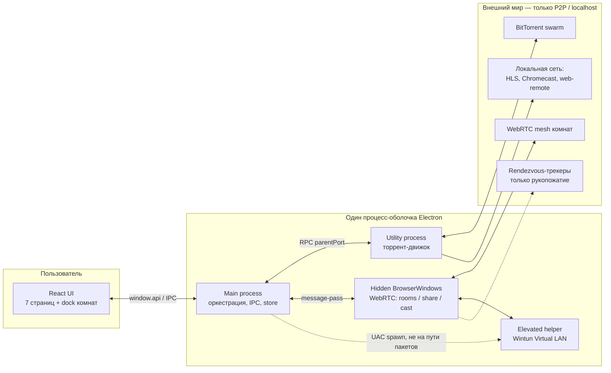

---

## 1. Что это за система

| Свойство | Как устроено |
|----------|----------------|
| Тип продукта | Один desktop-app, не монорепо и не клиент-сервер |
| Источник истины | Main-процесс + локальные JSON (`electron-store`) |
| UI | React 18, клиентский «роутинг» через `currentPage` в `App.tsx` |
| Контракт UI ↔ ядро | Типизированный `IpcApi` (`shared/types.ts`) → `window.api` |
| Движок закачки | Transmission sidecar (по умолчанию) + WebTorrent fallback |
| Комнаты / шаринг / голос | WebTorrent + WebRTC в скрытых `BrowserWindow` |
| Идентичность | Локальная Ed25519-пара на установку, без аккаунтов |
| Сеть разработчика | Нулевая: никаких своих серверов, кроме опциональных публичных WebRTC-трекеров |

Три TypeScript-корня компилируются раздельно:

| Корень | Роль | Сборка |
|--------|------|--------|
| `electron/` | Main, сервисы, IPC, нативные sidecar | `tsc -p tsconfig.electron.json` → `dist/electron/` |
| `renderer/` | React UI | Webpack → `dist/renderer/` |
| `shared/` | Типы и чистая логика для обоих процессов | Компилируется с electron, type-check для renderer |

```
Havvn/
├── electron/          main, IPC, torrent, rooms, LAN, game servers
├── renderer/          React pages, layout, i18n
├── shared/            типы, state-machine, LAN/RSS/search parsers
├── docs/              дизайн-доки и этот файл
├── scripts/           fetch-wintun, fetch-transmission, релизы
├── themes/            пресеты .havvn-theme.json
├── vendor/            Transmission + Wintun (gitignore, качаются скриптами)
└── .github/workflows/ CI (Windows) + release по тегу v*
```

---

## 2. Слои приложения

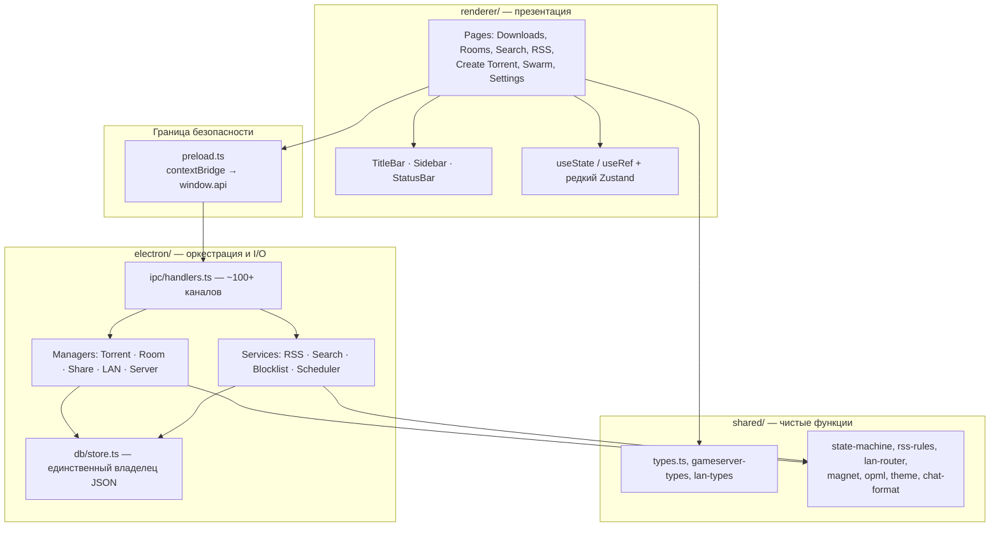

Правило слоёв:

1. **`shared/`** — без Electron, без `fs`, без побочных эффектов. Юнит-тесты Vitest живут рядом (`.test.ts`).
2. **`electron/`** — процессы, диски, дочерние процессы, IPC. Бизнес-решения по возможности делегирует в `shared/`.
3. **`renderer/`** — ввод пользователя и подписки. Не ходит в сеть и не пишет store напрямую.

---

## 3. Модель процессов

Одно приложение — несколько процессов с жёстким разделением ответственности. Тяжёлая работа и WebRTC специально вынесены из main, чтобы UI не замерзал и нативный `wrtc` не падал под Electron.

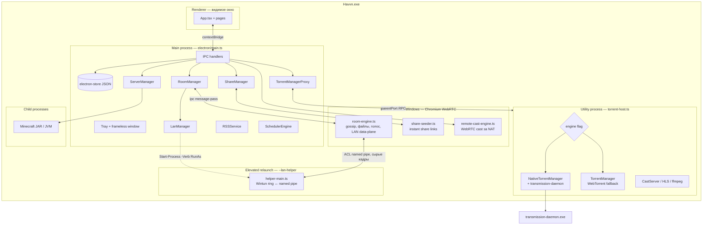

| Процесс | Файл входа | Зачем отдельный |
|---------|------------|-----------------|
| Main | `electron/main.ts` | Окна, tray, IPC, store, оркестрация. Не хеширует торренты и не держит WebRTC. |
| Renderer | `renderer/index.tsx` | UI. Изолирован: сеть и диск только через `window.api`. |
| Torrent host | `electron/torrent/host/torrent-host.ts` | Utility process: hashing, piece I/O, ffmpeg, stats 750 мс. |
| Room engine | `electron/sharing/room-engine.ts` | Hidden window: Chromium WebRTC (нативный `wrtc` падает в Electron). |
| Share seeder | `electron/sharing/share-seeder.ts` | Отдельное hidden window: шаринг в браузер друга. |
| Remote cast | `electron/sharing/remote-cast-engine.ts` | WebRTC-стрим за пределы LAN. |
| LAN helper | `electron/lan/helper-main.ts` | Админ-права только здесь. Тривиален: ring ↔ pipe, нуль протокольной логики. |
| Game server | spawn из `gameserver/` | JVM/JAR. Модуль игры **не** спавнит сам — только возвращает план. |

Особый режим запуска: `Havvn.exe --lan-helper` **не** поднимает окно, tray и торрент-движок. `app.whenReady` сразу вызывает `runLanHelper()`.

---

## 4. Последовательность старта

Окно поднимается **до** восстановления торрентов: верификация диска может идти десятки секунд, UI при этом уже интерактивен (API менеджера ждёт `initialize()`).

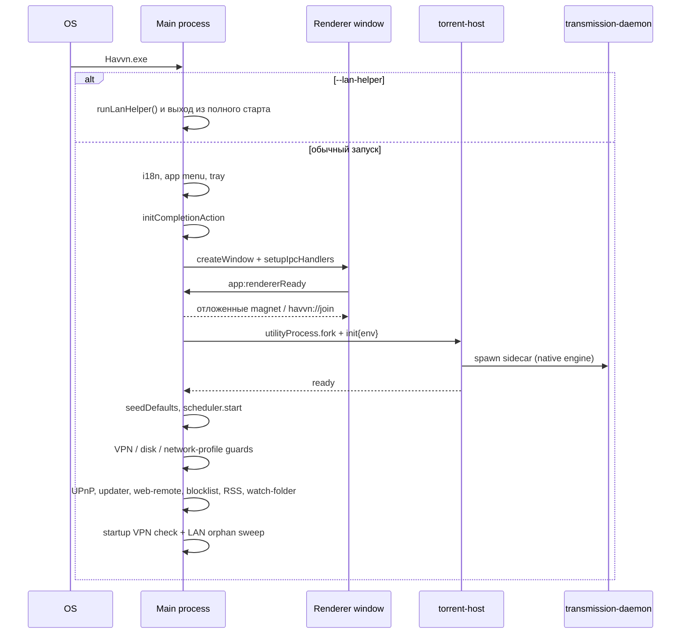

Глубокие ссылки буферятся до `app:rendererReady`:

- `magnet:` и `.torrent` → `app:openTorrent` (диалог добавления, без тихого add).
- `havvn://join/<invite>` → `app:joinInvite` (Join-диалог **с подтверждением**, автоджойна нет).

---

## 5. IPC: как UI говорит с ядром

Единственный мост — `contextBridge` в `electron/preload.ts`. Renderer видит `window.api: IpcApi`. Обработчики — `electron/ipc/handlers.ts`.

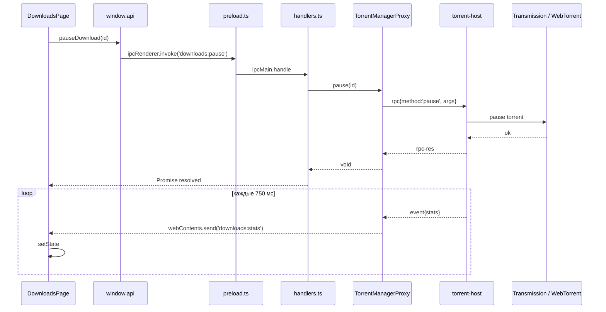

Обратный поток (main → renderer) — push-каналы, не polling:

| Канал | Что несёт |
|-------|-----------|
| `downloads:stats` | Живые скорости/прогресс всех торрентов |
| `rooms:update` | Полный `RoomState` одной комнаты |
| `rooms:srvUpdate` / `srvAlert` / `srvConsoleLines` | Игровой сервер |
| `app:openTorrent` / `app:joinInvite` | OS file association / deep link |
| `vpn:dropped` / `vpn:bind` | Kill-switch и пропавший bind |
| `completion:pending` | Обратный отсчёт sleep/shutdown |

Состояние UI — в основном React `useState` в `App.tsx` и страницах. Zustand только у мастера создания торрента. `localStorage` — тема, стартовая страница, часть префов. **Источник истины всегда main + store.**

---

## 6. Карта фич и страниц

Роутера нет: `App.tsx` держит `currentPage: PageId`. Downloads грузится eagerly, остальные страницы — `React.lazy`.

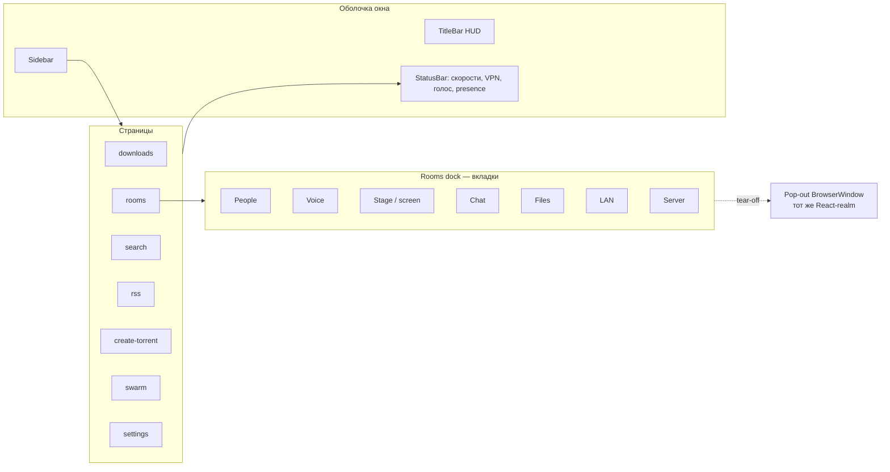

| Страница | Файл | Задача |
|----------|------|--------|
| Downloads | `renderer/pages/DownloadsPage.tsx` | Список закачек, add, плеер |
| Rooms | `renderer/pages/RoomsPage.tsx` | Дружеские рои: dock People/Voice/Stage/Chat/Files/LAN/Server |
| Search | `renderer/pages/SearchPage.tsx` | Поиск по пользовательским индексаторам |
| RSS | `renderer/pages/RSSPage.tsx` | Ленты, правила, OPML |
| Create torrent | `renderer/pages/CreateTorrentPage.tsx` | Мастер раздачи |
| Swarm | `renderer/pages/SwarmPage.tsx` | Карта пиров (d3-geo) |
| Settings | `renderer/pages/SettingsPage.tsx` | 12 секций |

Секции Settings: `general`, `downloads`, `connection`, `privacy`, `sharing`, `seeding`, `scheduler`, `interface`, `hotkeys`, `notifications`, `system`, `about`.

Группы навигации: **core / privacy / seeding / appearance / system**.

---

## 7. Домен закачек (BitTorrent)

### 7.1 Два движка за одним швом

UI и IPC **не знают**, какой движок работает. Main видит `TorrentManagerProxy`; host лениво `require()`-ит native или webtorrent по флагу настроек.

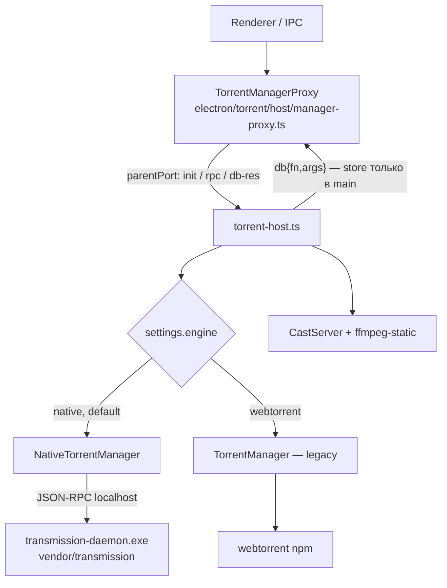

Контракт шва: `docs/native-host-contract.md`. Host шлёт `stats` каждые **750 мс**; прогресс батчем пишется в `downloads.json` каждые **5 с**.

Зачем WebTorrent остаётся: комнаты, instant share и remote-cast идут по WebRTC. Transmission качает файлы; WebRTC-фичи крутятся в hidden windows.

### 7.2 Машина состояний загрузки

Определена в `shared/state-machine.ts`. Нелегальный переход бросает `InvalidStateTransitionError`.

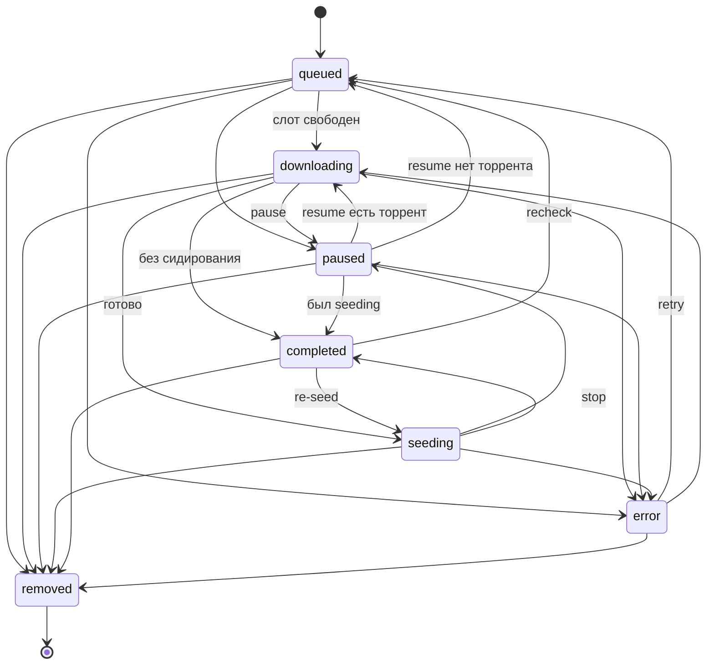

Любое состояние кроме `removed` может уйти в `error`. Любое — в `removed` (терминал).

### 7.3 Потоки вокруг закачки

```mermaid
flowchart LR
  subgraph In["Как торрент попадает в клиент"]
    File[".torrent / drag-drop"]
    Mag["magnet:"]
    URL["URL .torrent"]
    Search["Search → add"]
    Feed["RSS rule match"]
    Watch["Watch folder"]
    Clip["Clipboard watcher"]
    OS["OS association"]
  end

  In --> Add["downloads:add"]
  Add --> Host
  Host --> Disk["savePath / категории"]

  subgraph Out["Что можно сделать с файлом"]
    Play["Встроенный плеер + субтитры"]
    HLS["LAN HLS + QR"]
    TV["Chromecast"]
    Remote["WebRTC remote cast"]
    Share["Instant share link"]
    Room["Share into room"]
  end

  Disk --> Out
```

Cast/HLS живёт в torrent-host (рядом с кусками и ffmpeg). Chromecast — discovery в LAN. Web-remote — отдельный token-gated HTTP на пользовательском порту (по умолчанию 8788, выключен).

---

## 8. Комнаты (friend swarms)

Комната — приглашение-only mesh: файлы, чат, голос, скрин, виртуальный LAN, выделенный игровой сервер. Нет своего сигналинг-сервера: рукопожатие через публичные (или свои) WebRTC-трекеры; полезная нагрузка по data-каналам.

`RoomManager` в main — прокси + персист. Живая логика — в hidden `room-engine.ts`.

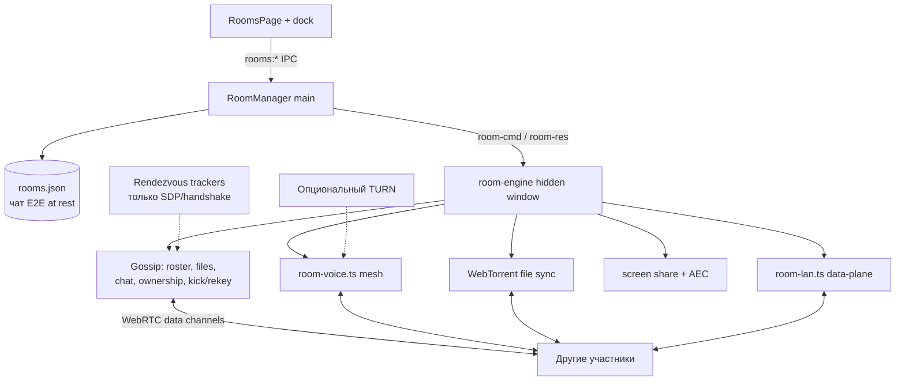

### 8.1 Идентичность и крипто

Аккаунтов нет. Безопасность — криптография установки и членства:

| Механизм | Назначение |
|----------|------------|
| Ed25519 на установку | Подпись чата, конфига, ownership chain |
| Invite-код | Выводит ключи комнаты; `codeIsE2E` отличает E2E-инвайт |
| AES-256-GCM | E2E содержимого и чата at rest |
| TOFU pubkeys | Привязка memberId → ключ при первом контакте |
| Owner-signed e2eCfg | Раздача content-key членам |
| transferChain | Подписанная цепочка смены владельца |
| Kick → rekey | Ротация topic/ключей, чтобы выгнанный не читал дальше |

Секреты (приватный ключ) — `electron/db/secrets.ts` через OS DPAPI / Keychain, не в открытом JSON.

### 8.2 Живое состояние, которое видит UI

Main кэширует последний `RoomState` и пушит `rooms:update`. В агрегат входят члены, файлы/папки, трансферы, голос, LAN, sync, unread.

Персист (`rooms.json`): комнаты, профиль, манифесты файлов, tombstones/revives (чтобы удаление пережило рестарт и gossip), last-read, LAN prefs.

---

## 9. Голос и экран

Голос — serverless mesh в том же room-engine, **не** тот же набор `RTCPeerConnection`, что LAN (разные каналы и другая авторизация).

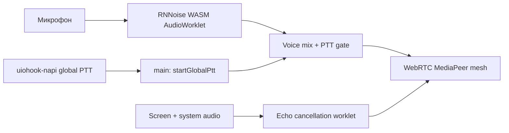

- Нейро-шумодав: `@jitsi/rnnoise-wasm`.
- Глобальный PTT крутится в main **только** пока какая-то комната в голосе в режиме PTT.
- В голосе максимум одна комната; `App.tsx` зеркалит call в StatusBar на всех страницах.

---

## 10. Виртуальный LAN

Hamachi-подобный L3-туннель внутри комнаты: игры, которые видят только LAN, ходят через интернет. Windows-first, Wintun, адреса из `100.64.0.0/10`, MTU **1280**.

Главное разделение: **helper тривиален и privileged, мозг — в engine-окне, main только оркестрирует и никогда не на пути пакета.**

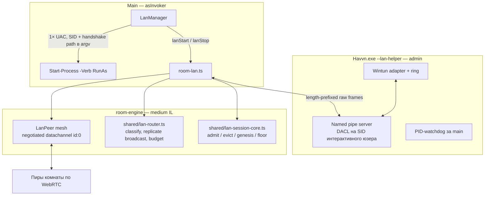

Инварианты (сжато; полная спецификация — `docs/handoff/virtual-lan-plan.md`):

1. Членство в комнате **необходимо, но недостаточно**. В mesh попадает только host-подписанный `lan-admit`.
2. vIP — чистая функция `(sessionId, memberId, gen)`; заявленный адрес сверяется, иначе unicast можно угнать.
3. Одна активная LAN-сессия на установку (бета).
4. sessionId переиспользуется между запусками **только** с персистентным watermark (`session.floor`), иначе старый `lan-admit` можно реплеить.
5. Evict ротирует sessionId (адреса меняются).
6. VPN-детектор исключает диапазон сессии `100.64/10`, а не имя адаптера — иначе leak или мёртвый bind.

---

## 11. Игровые серверы в комнате

Сейчас модуль — Minecraft. Архитектурный инвариант: **модуль возвращает план, ядро исполняет эффекты**. Модуль не качает, не спавнит, не пишет диск.

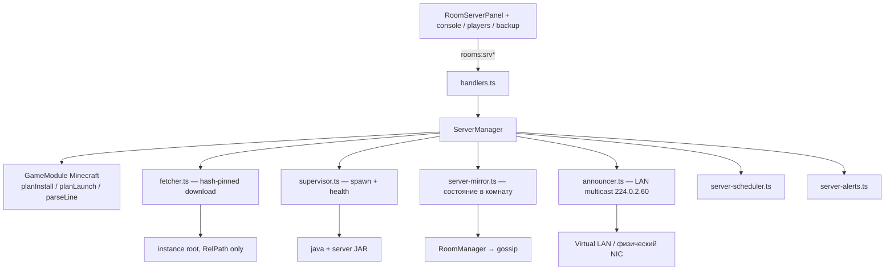

Три уровня доверия (`shared/gameserver-types.ts`):

| Тир | Что это | Уровень доверия |
|-----|---------|-----------------|
| A. Modules | Код в бандле | Полный |
| B. Presets | Данные: версия + конфиг, без URL/argv/exe | Безопасны для шаринга |
| C. Content | Моды/миры с манифеста комнаты | Недоверенные; exe — consent на хеш |

Путь из модуля — только `RelPath` без `..`. Ядро резолвит под корень инстанса (`shared/gameserver-core.ts`). Консоль в UI батчится (120 мс / 400 строк), чтобы старт модпака не убил IPC.

Состояние серверов — отдельный `servers.json` (`electron/db/servers-store.ts`).

---

## 12. Поиск и RSS

Индексаторы **не бандлятся**. Пользователь приносит Jackett, Prowlarr/Torznab, свой JSON API или локальный Python-скрипт (`docs/search-plugins/`). Единственный предзасеянный RSS — FOSS Torrents, **выключен**.

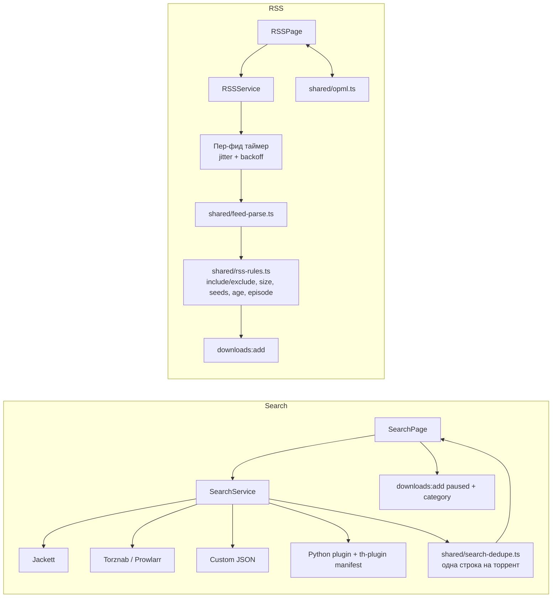

Правило RSS матчит слова/regex, размер, сиды, возраст; умный episode-match держит одну копию эпизода. Хватаются только пункты **после** подписки, не бэк-каталог.

---

## 13. Хранение данных

Нет Postgres/Redis/облака. `electron-store` пишет несколько JSON в `userData`, чтобы горячий прогресс закачек не переписывал многомегабайтный блоклист.

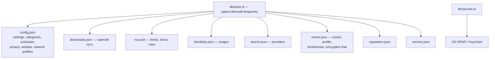

Torrent-host **не** открывает store: ходит в main через db-bridge (`getSettings`, `createDownload`, `updateDownloadsProgressBatch`, …). Один писатель — меньше гонок и поломанных файлов.

---

## 14. Доменные сущности

Центр контракта — `shared/types.ts` плюс `shared/gameserver-types.ts` и `shared/lan-types.ts`.

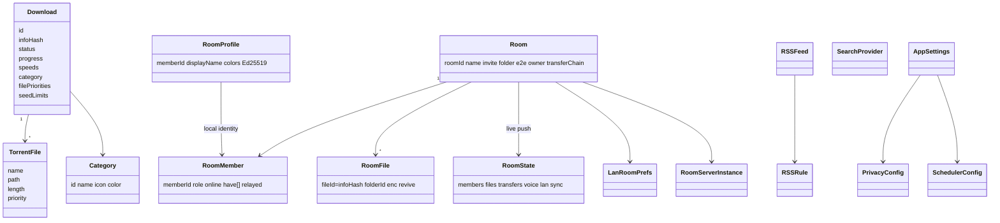

---

## 15. Локальные HTTP-поверхности

Это не публичный API продукта. Серверы слушают localhost / LAN по желанию пользователя.

| Сервер | Где | Зачем |
|--------|-----|--------|
| CastServer | torrent-host, динамический порт | HLS, транскод, QR «смотреть на телефоне» |
| WebRemoteServer | main, порт из настроек | Мобильный пульт, token auth, выключен по умолчанию |
| Transmission RPC | sidecar localhost | Управление native-движком |
| webpack-dev-server | только `npm run dev` | HMR renderer |
| Статика | `docs/share/index.html`, `docs/watch/index.html`, `docs/room/` | Браузер друга: принять шару / смотреть LAN / войти в комнату |

Внешние URL, которые пользователь сам настраивает: RSS, Jackett/Torznab, блоклисты, свои WebRTC-трекеры, опциональный TURN.

---

## 16. Фоновые таймеры

Отдельного job-раннера нет — всё in-process.

| Задача | Интервал | Где |
|--------|----------|-----|
| Статы закачек → UI | 750 мс | torrent-host |
| Персист прогресса | 5 с, debounce batch | host → db-bridge |
| Планировщик лимитов | 60 с | `scheduler-engine.ts` |
| RSS poll | пер-фид, дефолт 30 мин + jitter | `rss-service.ts` |
| Probe игрового сервера | 15 с | `server-manager.ts` |
| Расписание сервера | 15 с | `server-scheduler.ts` |
| Tray tooltip | 3 с | `main.ts` |
| UPnP renew | периодически | `port-forwarding.ts` |
| Clipboard magnets | poll | `clipboard-watcher.ts` |
| VPN / disk / network-profile | по событию сети | guards в `utils/` и `services/` |

---

## 17. Приватность и защита периметра

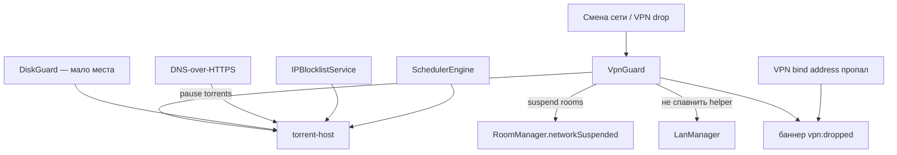

Kill-switch ставит `networkSuspended` на комнатах так, чтобы любой lazy re-join шёл через один гейт. Виртуальный LAN дополнительно проверяет VPN и после UAC (промпт может висеть сколько угодно, за это время VPN может отвалиться).

Логи проходят `privacy-logger` (санитизация IP/путей). Шифрование протокола BitTorrent — на стороне Transmission (`encryption: required|preferred|allowed`); в старом WebTorrent этого не было.

---

## 18. Сборка, тесты, релиз

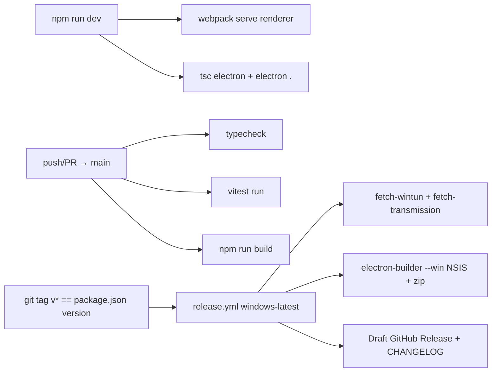

- Тесты: Vitest, без jsdom. Тяжёлая логика покрыта в `shared/*.test.ts` и точечно в electron.
- Протоколы установщика: `magnet:`, `havvn://`. Ассоциация `.torrent`.
- Релиз неподписанный (`CSC_IDENTITY_AUTO_DISCOVERY: false`). SHA-256 и VirusTotal — в notes.
- Vendor-бинари не в git: `node scripts/fetch-wintun.mjs` и `fetch-transmission.mjs`.

---

## 19. Как сценарии проходят через систему

### Добавить торрент и смотреть по LAN

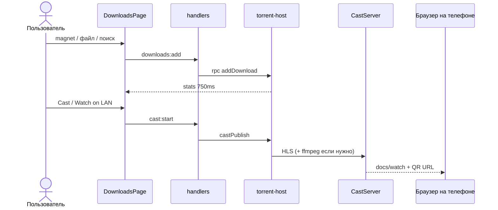

### Создать комнату, синхронизировать файл, включить LAN и Minecraft

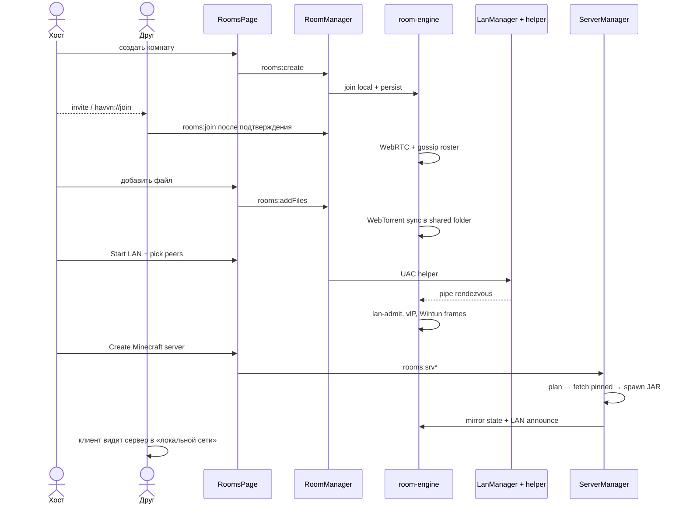

---

## 20. Ключевые файлы — навигатор

| Зачем открыть | Файл |
|---------------|------|
| Старт приложения, tray, lifecycle | `electron/main.ts` |
| Весь IPC | `electron/ipc/handlers.ts` |
| Контракт `window.api` | `electron/preload.ts`, `shared/types.ts` |
| Store и миграции JSON | `electron/db/store.ts` |
| Шов торрент-движка | `electron/torrent/host/manager-proxy.ts`, `torrent-host.ts` |
| Transmission sidecar | `electron/torrent/native/` |
| Комнаты | `electron/sharing/room-manager.ts`, `room-engine.ts` |
| Голос | `electron/sharing/room-voice.ts` |
| LAN data-plane | `electron/sharing/room-lan.ts`, `electron/lan/lan-manager.ts` |
| Чистый LAN-роутер | `shared/lan-router.ts`, `shared/lan-session-core.ts` |
| Игровые серверы | `electron/gameserver/server-manager.ts` |
| UI-оболочка | `renderer/App.tsx` |
| Машина состояний закачки | `shared/state-machine.ts` |

Смежные дизайн-доки: `docs/engine-swap-plan.md`, `docs/native-host-contract.md`, `docs/handoff/virtual-lan-plan.md`, `docs/voice-chat-plan.md`, `docs/rooms-ownership-transfer.md`, `docs/rooms-kick-hardening.md`, `docs/handoff/CONVENTIONS.md`.

---

## 21. Чего в архитектуре намеренно нет

- Облачных аккаунтов, OAuth, центрального API.
- Docker / Kubernetes / отдельного backend-сервиса.
- GraphQL, REST для продукта, общего WebSocket-сервера (вместо этого — WebRTC data channels).
- Prisma / Mongo / Redis.
- React Router (страница — состояние `App.tsx`).
- Глобального Zustand-стора приложения.

Итог в одном предложении: **Havvn — многопроцессный локальный оркестратор**, у которого UI подписан на IPC, файлы живут в JSON, байты файлов идут BitTorrent/WebTorrent, а «онлайн» комнаты — это WebRTC-mesh с опциональным L3-туннелем и игровым процессом внутри, без серверов разработчика.
